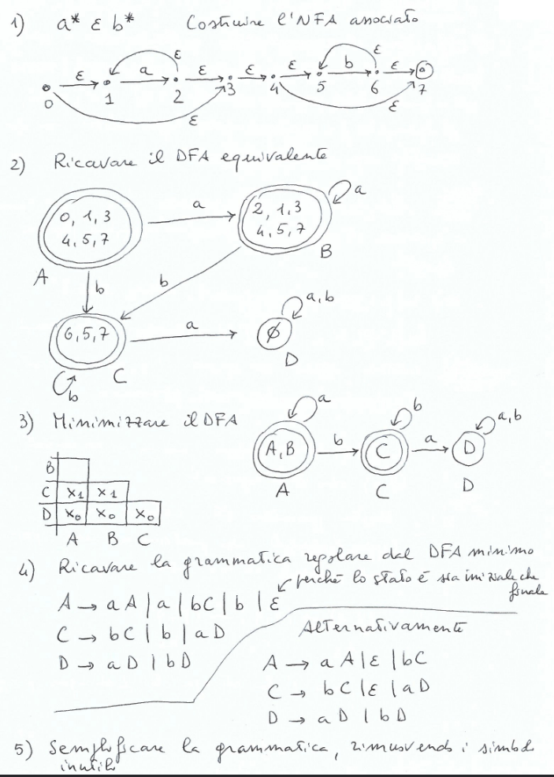
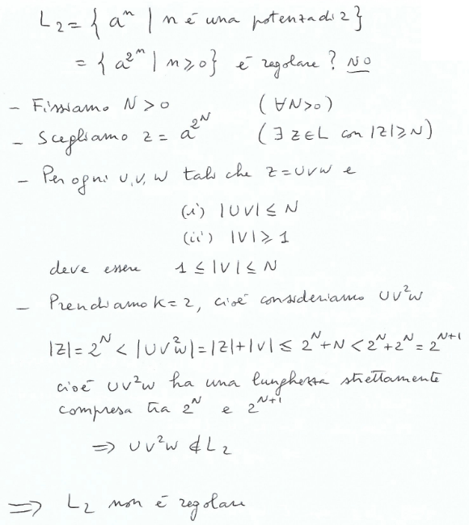
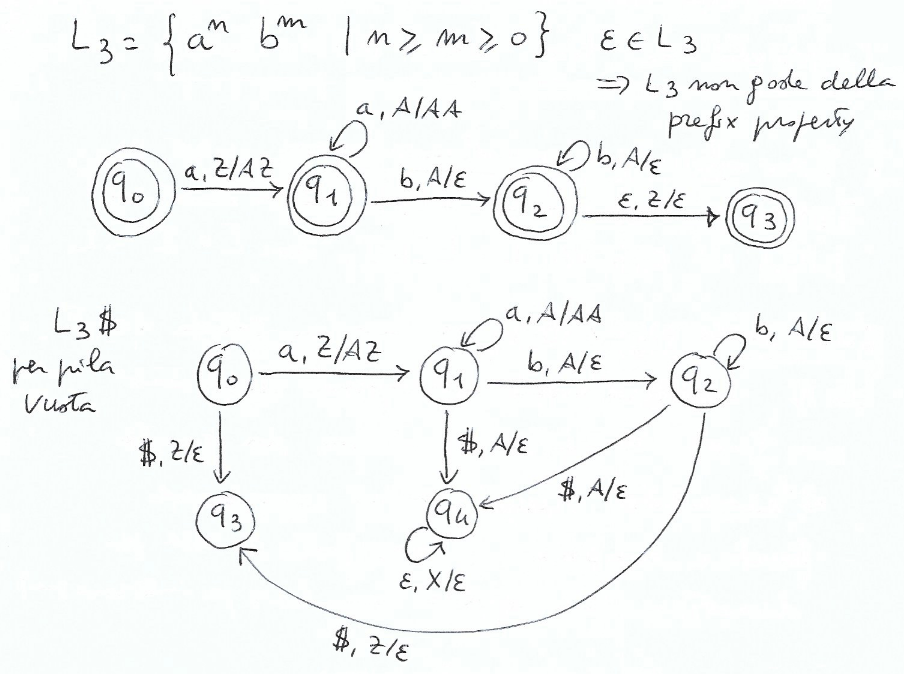
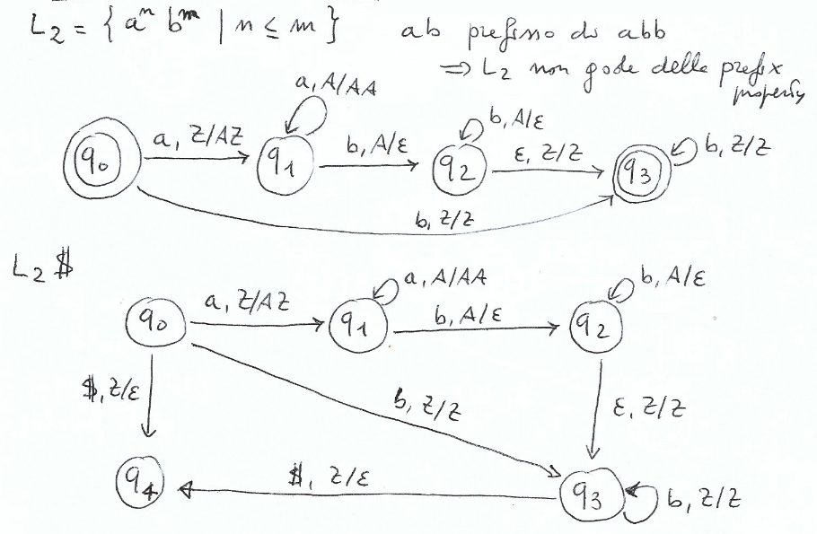
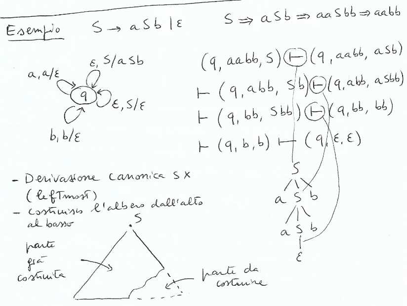
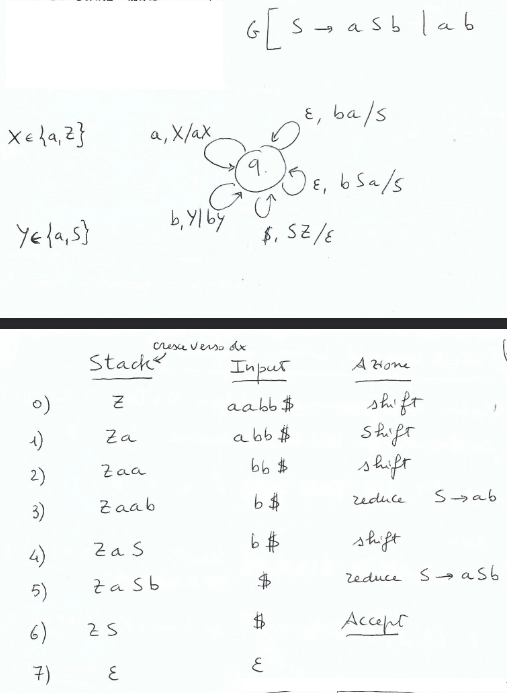

# Capitolo 1 - Interpreti e Compilatori
$I^{L_A}_{L_B} \rArr$ Interprete scritto in $L_A$ per il linguaggio $L_B$

$C^{L_A}_{L_B, L_C} \rArr$ Compilatore scritto in $L_A$, che traduce da $L_B$ in $L_C$

# Capitolo 2 - Descrivere un linguaggio di programmazione
- **Sintassi**: Regole di formazione
  - Aspetto Lessicale
  - Aspetto Grammaticale
- **Semantica**: Attribuzione di significato
  - Per il lessico -> Dizionari
  - Per le frasi devo sapere
    - A quale linguaggio la frase appartiene
    - Su quale linguaggio basarmi per darne significato
- **Pragmatica**: In quale modo frasi corrette?
  - Insieme di regole che *guidano* l'uso
- **Implementazione**: Come eseguire una frase corretta
  - Esegue una frase *sintatticamente corretta* rispettandone la sematica

Quest'ultimo ovvimente solo per i linguaggi eseguibili

## Lessico e Frasi di un Linguaggio
- Alfabeto: `a, b, c, ...`
  - Lessico: Insieme di sequenze finite (parole) costruite con caratteri (simboli) dell'alfabeto
    - Frasi: Insieme di sequenze finite costruite con parole del lessico

### Linguaggio Formale
> Sottoinsieme di $A^*$, ovvero $L \subseteq A^*$

## Come definire un Linguaggio
- Generativi/Sintentici:
  - Linguaggio = insieme di stringhe generate da una **grammatica**
- Riconoscitivi/Analitici:
  - Linguaggio = insieme di stringhe riconosciute da un **automa**

### Definire finitamente un linguaggio
Con un esempio: palindrome

$$A = {a, b} \quad L = \{\epsilon, a, b, aa, bb, ...\}$$

Usando la **Backus-Naur Form** (BNF)
$$
 ::= \epsilon \mid a \mid b \mid a 
 a \mid b 
 b$$

O scrivendola come grammatica
$$P \rightarrow \epsilon \mid a \mid b \mid aPa \mid bPb$$

Definizione ricorsiva in cui:
- $P$ è detto simbolo *non terminale*
- $a, b$ sono detti simboli *terminali*

Oppure da queste regole insieme agli assiomi e le regole d'inferenza
$$ \frac{}{\epsilon \in L(P)} \quad \frac{}{a \in L(P)} \quad \frac{}{b\in L(P)} \quad \frac{w \in L(P)}{awa \in L(P)} \quad \frac{w \in L(P)}{bwb \in L(P)}$$
con $L(P)$ linguaggio generato a partire dal non terminale $P$

## Grammatiche
Una **Grammatica libera** è una quadrupla $(NT, T, R, S)$ dove
- $NT$ insieme finito di simboli non-terminali
- $T$ insieme finito di simboli terminali
- $R$ insieme finito di produzioni nella forma
  - $V \rarr w$ dove $V \in NT$ e $w \in (T \cup NT)^*$
- $S \in NT$ è detto simbolo iniziale

Esempio: $G = (\{S\}, \{a, b, +, *\}, S, R)$
- dove $R = \{S \rarr a, S \rarr b, S \rarr S + S, S \rarr S * S\}$

Forma in cui si trova di solito: $S \rarr a \mid b \mid S + S \mid S * S$

## Derivazioni
Data $G = (NT, T, R, S)$ libera diciamo che *$v$ si riscrive in un passo in $w$*, denotato con $v \rArr w$, se

$$\frac{v = xAy \qquad (A \rarr z) \in R \qquad w = xzy}{v \rArr w} \qquad x, y, z \in (T \cup NT)^*$$

Diciamo inoltre che *$v$ si riscrive in $w$*, denotato con $v \rArr^* w$ se $v$ si riscrive in più passi in $w$, cioè

$$\frac{}{v \rArr^* v} \quad \frac{v \rArr^* w \quad w \rArr z}{v \rArr^* z}$$

$\rArr^*$ è la chiusura riflessiva e transitiva della relazione $\rArr$

## Linguaggio generato
Il linguaggio generato da una grammatica $G = (NT, T, R, S)$ è l'insieme
$$L(G) = \{ w \in T^* | S \rArr^* w\}$$

Esempio: $G: S \rarr aSb \mid ab$ genera $L(G) = \{a^n b^n | n \geq 1 \}$

## Derivazioni e Alberi
- Consideriamo $S \rarr a \mid b \mid c \mid S+S \mid S*S$ e l'espressione $a + b * c$
- Consideriamo la **derivazione** $S \rArr \underbar{S} * S \rArr \underbar{S} + S * S \rArr a + \underbar{S} * S \rArr a + b * \underbar{S} \rArr a + b * c$
  - **leftmost**: ad ogni passo riscriviamo il non terminale più a sinistra
  - possibile associarci un *albero di derivazione*
- Consideriamo ora la **derivazione** $S \rArr S * \underbar{S} \rArr \underbar{S} * c \rArr S + \underbar{S} * c \rArr \underbar{S} + b * c \rArr a + b * c$
  - **rightmost**: ad ogni passo riscriviamo il non terminale più a destra
  - possibile associarci lo stesso *albero di derivazione*

**Teorema**: $w \in T^*$ appartiene a $L(G)$ $\iff$ ammette un albero di derivazione completo

## Ambiguità
- Una grammatica libera $G$ è **ambigua** se $\exists w \in L(G)$ che ammette più alberi di derivazione
- Un linguaggio $L$ è **ambiguo** se tutte le grammatiche $G$ che lo generano sono ambigue
- Grammatiche **patologiche**, quando non è possibile manipolarle per disambiguarle
- Esempio di linguaggio ambiguo:
$$\{a^n b^n c^m d^m | n, m \geq 1\} \cup \{a^n b^m c^m d^n | n, m \geq 1\}$$

## Struttura di un Compilatore

## Fasi principali della Compilazione
### Analisi Lessicale (Scanner)
- Spezza il programma sorgente nei componenti sintattici primitivi (*tokens*)
- Controlla solo che il lessico sia ammissibile

### Analisi Sintattica (Parser)
- Produce l'albero di derivazione del programma, riconoscendo se le frasi sono sintatticamente corrette
  
### Analisi Sematica
- Controlli di semantica statica
- Ad esempio arricchisce l'albero di derivazione generato dal Parser con informazioni sui tipi

### Generazione della forma intermedia
- Genera codice scritto in un linguaggio intermedio

### Ottimizzazione
- Ottimizzazioni sul codice per renderlo più efficente
- Esempi: dead code, macro, ecc

### Generazione del codice
- Viene generato codice per una specifica architettura

### Tabella dei simboli
- Memorizza le informazioni sui nomi presenti nel programma
  
## Semantica Operazionale Strutturata
### Come dare la semantica?
- **Sistema di transizione**: tripla $< \Gamma, T, \rarr >$ dove
  - $\Gamma$ è l'insieme di stati
  - $T \subseteq \Gamma$ è l'insieme degli stati terminali
  - $\rarr \subseteq \Gamma \times \Gamma$ è la relazione di transizione
- Store $\sigma = \{ x_1 / n_1, x_2 / n_2, \dots, x_k / n_k \}$

### Semantica delle espressioni aritmetiche
EVENTUALMENTE AGGIUNGERE COSE (TODO)

# 3 - Analisi Lessicale
## Analisi Lessicale
- Riconoscere nella stringa in ingresso gruppi di simboli che corrispondono a specifiche categorie sintattiche
- La stringa in input è trasformata in una sequenza di *token*
### Cos'è un *token*?
- $Token = (nome, valore)$
- Esempio: $<Ide, x_1>$

### Espressioni Regolari
- Fissato un alfabeto $A = \{ a_1, a_2, \dots, a_n \}$ definiamo le espressioni regolari con la seguente BNF
$$ r ::= \emptyset \mid \epsilon \mid a \mid r \bullet r \mid r | r \mid r^* $$

### Linguaggio Regolare
- Linguaggio $L \subseteq A^*$ è **regolare** se $\exists$ $r$ espressione regolare che lo genera
- **Proposizione**: Ogni linguaggio finito è regolare

## Automi (a stati) Finiti
- Caratteristiche:
  - Memoria finita
  - Input: stringa da riconoscere
  - Output: 1 bit (sì/no)
- Leggono l'input in ordine fino a che
  - Finiscono l'input e riconosce la stringa
  - Si blocca e non riconosce la stringa

### Diagrammi di Transizione
$$L = \{ w \in \{ 0, 1\}^* \mid \text{numero di 0 e 1 è pari}\}$$

## Automi Finiti Nondeterministici
- Un NFA è un quintupla $(\Sigma, Q, \delta, q_0, F)$ dove
  - $\Sigma$ è un alfabeto finito di simboli di input
  - $Q$ è un insieme finito di stati
  - $q_0 \in Q$ è lo stato iniziale
  - $F \subseteq Q$ è l'insieme degli stati finali
  - $\delta$ è la funzione di transizione con tipo:
$$\delta: Q \times (\Sigma \cup \{ \epsilon \}) \rarr P(Q)$$

### Linguaggio riconosciuto
- Un NFA accetta $w$ $\iff$ nel diagramma di transizione esiste un cammino da $q_0$ ad uno stato finale nel quale si ottiene $w$
## Deterministic Finite Automata (DFA)
- $\delta(q, G)$ è sempre un singoletto
  - ovvero esiste solo una mossa possibile da ogni stato
- non ci sono mosse $\epsilon$
- Un DFA è una quintupla $(\Sigma, Q, \delta, q_0, F)$, dove $\Sigma, Q, q_0, F$ sono definiti come un NFA, ma $\delta$ ha tipo $\delta: Q \times \Sigma \rarr Q$
- **Proposizione**: Per ogni NFA, è possibile costruire un DFA ad esso equivalente
### Esempio

### Costruzione dei sottoinsiemi
Dato un NFA $N = (\Sigma, Q \delta, q_0, F)$
- Inizializza $S = \epsilon - closure(q_0)$
- Inizializza $T = \{ S \}$
- Finchè c'è un $P \in T$ non marcato
  - Marca $P_i$
  - For each $a \in \Sigma$
    - $R = \epsilon - closure(mossa(P, a))$
    - If $R \not \in T$
      - add $R$ to $T$
    - Definisci $\Delta (P, a) = R$
### Esempio Corposo

## Equivalenza NFA - DFA
- **Teorema** Sia $N$ un NFA e sia $M_N$ l'automa ottenuto con la costruzione per sottoinsiemi. Allora $M_N$ è un DFA e si ha $L[N] = L[M_N]$
  - **Dimostrazione** TODO (pag 28)

## Da espressioni Regolari a NFA equivalenti
- **Teorema** Data una espressione regolare $s$, possiamo costruire un NFA $N[s]$ tale che $\textbf{L}[s] = L[N[s]]$
  - **Dimostrazione** TODO

### Grammatiche Regolari
- **Def** Una grammatica *libera* è **regolare** $\iff$ ogni produzione è nella forma $V \rarr aW$ oppure $V \rarr a$. È ammessa la produzione $S \rarr \epsilon$
- **Teorema** Data una grammatica regolare $G$ si può costruire un NFA $N_G$ equivalente
  - **Dimostrazione** TODO FORSE

### Da DFA a Grammatiche Regolari
- **Teorema** Da un DFA $M$, possiamo definire una grammatica regolare $G_M$ tale che $L[M] = L(G_M)$
  - **Dimostrazione** TODO FORSE

## Riassunto
Espressioni Regolari, NFA, DFA e Grammatiche Regolari sono **formalismi equivalenti**.

Tutti

| generano | riconoscono | descrivono |
| --- | --- | --- |
| grammatiche regolari | NFA / DFA | espressioni regolari |

la stessa classe di linguaggi, ovvero i **Linguaggi Regolari**

## Minimizzazione
- Se da due stati di un DFA otteniamo lo stesso linguaggio allora gli stati sono equivalenti e il DFA può essere ottimizzato
- Un DFA si dice **minimo** se non ci sono stati equivalenti al suo interno
- **Def** Due stati $q_1$ e $q_2$ sono **equivalenti** se
  - $\forall x \in \Sigma^* \qquad \hat{\delta}(q_1, x) \in F \iff \hat{\delta}(q_2, x) \in F$
  - cioè se $L[N, q_1] = L[N, q_2]$
  - 
### Algoritmo per minimizzare un DFA
- Cerco di vedere quali coppie di stati **non** sono equivalenti
1. $\epsilon$ distingue ogni stato di F da ogni stato in $Q \setminus F$
2. Considero ora le stringhe di lunghezza $1$
   1. Vedo se distinguono stati
3. Procedo con stringhe di lunghezza 2, fino a che non riesco a fare nessuna distinzione
4. Quelli rimasti sono stati equivalenti

### Esempio

### Algoritmo pratico
- Tabella con solo coppie "vere"
- Al round 0 marco con $x_0$ per segnalare che la coppia è distinta (finale/nonfinale o nonfinale/finale)
- Al round 1 marco con $x_1$ per distinguere le coppie non ancora marcate
- Al round 2 marco con $x_2$ ...
- Mi fermo quando non posso più marcare nulla

### Esempio di prima con Tabella

- **Teorema** Dato un DFA $M = (\Sigma, Q, \delta, q_0, F)$, l'algoritmo di riempimento della tabella a scala termina. Due stati si dicono distinguibili se e solo se la casella corrispondente è marcata
  - **Dimostrazione** TODO

### Esercizio completo NFA -> DFA -> Minimizzare -> Grammatica Regolare -> Semplificare -> Espressione Regolare

- Questo esercizio dimostra che NFA, DFA, Grammatiche Regolari ed Espressioni Regolari hanno lo stesso potere espressivo

## LEX: Generatore di Scanner
- Lex e Flex sono software per generare un analizzatore lessicale
- Prendono in input un programma `.l` e in output restituiscono un programma C che realizza l'automa riconoscitore

## Pumping Lemma (IMPORTANTE)
- Se $L$ è regolare, allora $\exists N > 0$ tale che $\forall z \in L$ con $|z| \geq N$, $\exists u, v, w$ tali che
  - $z = uvw$
  - $|uv| \leq N$
  - $|v| \geq 1$
  - $\forall k \geq 0 \qquad u v^k w \in L$
- Inoltre $N$ è minore o uguale al numero di stati del DFA minimo che accetta $L$
  - **Dimostrazione** TODO (Questa è da fare)

### Negazione del Pumping Lemma
- **SE** $\forall N > 0, \exists z \in L$ con $|z| \geq N$, $\forall u, v, w$
  - Se
    - $z = uvw$
    - $|uv| \leq N|$
    - $|v| \geq 1$
  - Allora
    - $\exists k \geq 0, u v^k w \not \in L$
- **ALLORA** $L$ non è regolare

### Esempio

## Altre proprietà dei linguaggi regolari
- **Proposizione** La classe di linguaggi regolari è chiusa per
  - Unione
  - Concatenazione
  - Stella di Kleene
  - Complementazione
  - Intersezione
- **Dimostrazione** TODO

# 4 - Analisi Sintattica
## Linguaggi Liberi
- Grammateiche libere sono più generali di quelle regolari

| Regolari | Libere |
| :-: | :-: |
| $V \rarr aW$ o $V \rarr a$ o $S \rarr \epsilon$ con $V, W \in NT, a \in T$ | $V \rarr \alpha$ con $\alpha \in (T \cup NT)^*, V \in NT$

- Automi a pila (*pushdown automata*, PDA) invece di automi finiti
  - Non determinisitici -> Linguaggi liberi
  - Deterministici -> Costruzione dei compilatori
    - Top-down -> Grammatiche $LL(K)$
    - Bottom-up -> Grammatiche $LR(K)$

## Analisi Sintattica
- **Def** Una **Grammatica libera** è una quadrupla $G = (NT, T, R, S)$ con
  - $NT$ è un insieme finito di non terminali
  - $T$ è un insieme finito di terminali
  - $S \in NT$ è il simbolo iniziale
  - $R$ è un insieme finito di produzioni del tipo
    - $V \rarr \alpha$ con $\alpha \in (T \cup NT)^*, V \in NT$
- **Def** Derivazione *leftmost*, viene sempre riscritto il non terminale più a sinistra
- **Def** Derivazione *rightmost*, viene sempre riscritto il non terminale più a destra
- Potenziamo quindi gli NFA e i DFA per fargli "ricordare" cosa abbiamo già scorso
  - Usiamo una **pila**

### PDA
- **Def** Un **PDA** è una settupla $(\Sigma, Q, \Gamma, \delta, q_0, \bot, F)$ dove
  - $\Sigma$ è un alfabeto finito
  - $Q$ è un insieme finito di stati
  - $\Gamma$ è un insieme finito di simboli della pila
  - $\delta$ è una funzione di transizione con tipo
    - $\delta \colon Q \times (\Sigma \cup \{\epsilon\}) \times \Gamma \rarr P_{fin} (Q \times \Gamma ^*)$
    - $(\Sigma \cup \{\epsilon\})$ consuma un simbolo di input ($\Sigma$) oppure no ($\epsilon$)
    - Sulla pila scrive una stringa di lunghezza qualsiasi (anche $\epsilon$) di simboli di $\Gamma$
- È **non deterministico** perchè ci possono essere più funzioni di transizione con lo stesso tipo

### Linguaggio Accettato
- Due modalità di riconoscimento
  - Per stato finale (indicato con $L[N]$)
  - Per pila vuota (indicato con $P[N]$)

### Esempio
- Per il linguaggio $\{ww^R \mid w \in \{a, b\}^*\}$
- Diagramma di transizione del PDA

- In questo caso svuoto la pila se e solo se vado sullo stato $s_2$, quindi il PDA per stato finale e per pila vuota è equivalente

### Differenze tra pila vuota e stato finale
- La classe dei linguaggi riconosciuti per pila vuota o per stato finale **non cambia**
- **Teorema**
  - Se $L = P[N]$ per pila vuota, possiamo costruire $N'$ tale che $L = L[N']$
  - Se $L = L[N]$ per stato finale, possiamo costruire $N'$ tale che $L = P[N']$
- **Dimostrazione** TODO

- **Teorema** Un linguaggio $L$ è libero $\iff$ è accettato da un PDA
  - **Dimostrazione** TODO (da fare solo ->, non <-)

### Proprietàdi chiusura dei lingauggi liberi
- **Teorema** I linguaggi liberi sono **chiusi** per
  - Unione
  - Concatenazione
  - Ripetizione (stella di Kleene)
- **Dimostrazione** TODO

- **Teorema** L'**intersezione** $L_1 \cap L_2$ di un linguaggio **libero** $L_1$ con un lingauggio **regolare** $L_2$ è un linguaggio libero
- **Dimostrazione** TODO

- Si può usare questo teorema per *dimostrare che un linguaggio non nè libero*
  - Basta metterlo in intersezione con un linguaggio regolare e dimostrare chge l'intersezione non è libero

### Pumping Theorem
- Se $L$ è libero, allora $\exists N > 0$ tale che $\forall z \in L$ con $|z| \geq N, \exists u, v, w, x, y$ tali che
  1. $z = uvwxy$
  2. $|vwx| \leq N$
  3. $|vx| \geq 1$
  4. $\forall k \geq 0, \quad u v^k w x^k y \in L$
- **Dimostrazione** TODO

- Usiamo il Pumping Theorem "al contrario" per dire che un linguaggio non è libero
  - SE $\forall N > 0 \exists z \in L$ con $|z| \geq N$ tale che $\forall u, v, w, x, y$
    - Se
      1. $z = uvwxy$
      2. $|vwx| \leq N$
      3. $|vx| \geq 1$
    - Allora $\exists k \geq 0, \quad u v^k w x^k y \not \in L$
  - ALLORA $L$ non è libero

#### Esempio di utilizzo

# 5 - Linguaggi liberi deterministici, DPDA e Semplificazione di grammatiche

## Linguaggi liberi deterministici e DPDA
- **Def** Un PDA si dice **deterministico** e si indica con **DPDA** se e solo se
  1. $\forall q \in Q, \forall z \in \Gamma$
     - Se $\delta(q, \epsilon, z) \neq \emptyset$
     - Allora $\delta(q, a, z) = \emptyset \quad \forall a \in \Sigma$
  2. $\forall q \in Q, \forall z \in \Gamma, \forall a \in \Sigma \cup \{ \epsilon \} \quad |\delta(q, a, z)| \leq 1$

- **Def** Un linguaggio è **libero deterministico** se è accettato per **stato finale** da un DPDA
  
- **Teorema** La classe dei linguaggi liberi deterministici è inclusia propriamente nella classe dei linguaggi liberi
  
- **Proposizione** Se $L$ è regolare, allora $\exists$ DPDA $N$ tale che $L = L[N]$ per stato finale
  - **Dimostrazione** TODO
  
## Prefix Property

- **Fatto** Un linguaggio libero deterministico $L$ è riconosciuto da un DPDA per pila vuota SE E SOLO SE $L$ gode della **prefix property**
  - **Prefix Property** $\not \exists x, y \in L$ tale che $x$ è prefisso di $y$

### Esempio di utilizzo con DPDA

### ALTRO ESEMPIO MOLTO IMPORTANTE

### ALTRO ESEMPIO MOLTO IMPORTANTE

## Proprietà dei lingauggi liberi deterministici
- Chiusi per complementazione
- *NON* Chiusi per interesezione
- *NON* Chiusi per unione

## Parser
- Due tipi:
  - **Top-Down**: derivazione *leftmost* per $w$ a partire dal simbolo iniziale $S$ (all'inizio della pila)
  - **Bottom-Up**: Derivazione *rightmost* (a rovescio) a partire dalla stringa $w$ cercando di ridurlo al simbolo iniziale $S$ (alla fine della pila)

### Top-Down Parsing
- Data $G = (NT, T, S, R)$ libera, costruiamo il PDA $M = (T, \{q\}, T \cup NT, \delta, q, S, \empty)$, che riconosca per pila vuota, con $\delta$ definita come:
  - $(q, \beta) \in \delta(q, \epsilon, A) \quad$ se $A \rarr \beta \in R$ (espandi)
  - $(q, \epsilon) \in \delta(q, a, a) \quad \forall a \in T$ (consuma)
- **Non deterministico!**
  - Occorre *look-ahead*

#### Esempio

### Bottom-Up Parsing
- Data $G = (NT, T, S, R)$ libera, costruiamo il PDA, che riconosca $L(G)\$$, $M = (T, \{q\}, T \cup NT \cup \{z\}, \delta, q, z, \empty)$ dove:
  - $(q, aX) \in \delta(q, a, X) \quad \forall a \in T, \forall X \in T \cup NT \cup \{z\}$ (SHIFT)
  - $(q, A) \in \delta(q, \epsilon, \alpha^R) \quad$se $A \rarr a \in R$ (REDUCE)
  - $(q, \epsilon) \in \delta(q, \$, Sz)$ (ACCEPT)

- **Non deterministico!**
  - Conflitti *shift-reduce*
  - Conflitti *reduce-reduce*
- Per ottenere un DPDA serve introdurre informazioni agiuntive per risolvere i conflitti
  - Più stati
  - Look-ahead

#### Esempio

ARRIVATO A PAGINA 18
