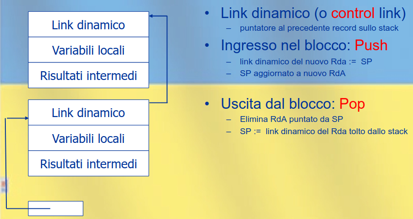
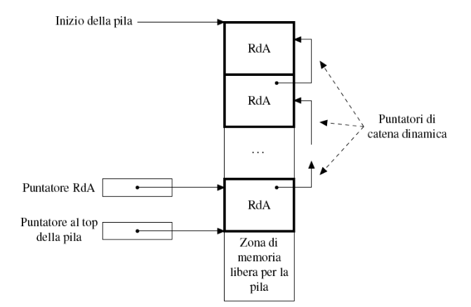
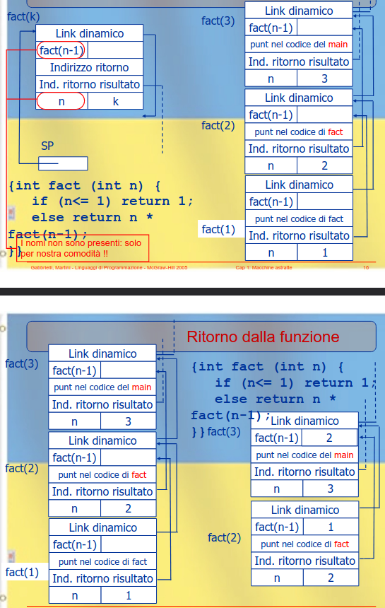

# Introduzione
- Linguaggi Imperativi
  - Basati sulla nozione di stato
  - Le istruzioni sono **comandi** che cambiano lo stato
  - Es. C, Pascal, FORTRAN, COBOL, ...
- Linguaggi Dichiarativi
  - Basati sulla nozione di funzione
  - Le istruzioni sono **dichiarazioni** di nuovi valori, tramite singole funzioni o composizione di esse

I lingauggi dichiarativi si dividono in due gruppi
- Funzionali (Lisp, Scheme, ML, Haskell)
  - Basati sulle funzioni
- Logici (Prolog, CLP)
  - Basati sulle relazioni

## Come Confrontare i Linguaggi

    DA FARE

# Nomi
- Un **nome** è una sequenza di caratteri usata per *denotare* qualcos'altro
- Nei linguaggi sono spesso **identificatori**

Usiamo questi termini in modo equivalente:
- binding = legame = associazione
- environment = ambiente
- scope = portata, estensione
- lifetime = vita

## Binding
- **Statico**
  - Progettazione del linguaggio
  - Scrittura del programma
  - Compilazione
- **Dinamico**
  - Esecuzione

## Ambiente
**Ambiente**: Insieme di associazioni fra nomi e oggetti denotabili esistenti a run-time in uno specifico punto del programma ed in uno specifico momento dell'esecuzione

**Dichiarazioni**: Meccanismo col quale si crea un'associazione in ambiente

Quindi lo stesso nome può indicare oggetti diversi all'interno del programma

**Aliasing**: Nomi diversi denotano lo stesso oggetto, passaggio per riferimento, puntatori, ecc.

## Blocchi
Regione testuale del programma, identificvato da un inizio e una fine. Può contenere dichiarazioni *locali* a quella regione

Vengono usati per fare chiarezza, per dare struttura al programma. Inoltre permettono di ottimizzare l'occupazione della memoria e permettono la ricorsione

### Suddividiamo l'ambiente
L'ambiente in uno specifico blocco può essere suddiviso in:
- **Ambiente Locale**: Associazioni create all'interno del blocco
- **Ambiente non Locale**: Associazioni ereditate da altri blocchi
- **Ambiente globale**: Quella parte di ambiente non locale relativo alle associazioni comuni a tutti i blocchi

## Operazioni
### Sull'Ambiente
- Creazione: associazione nome - oggetto denotato
  - Dichiarazione locale in blocco
- Riferimento: oggetto denotato mediante il suo nome
  - Uso di un nome
- Disattivazione: assocazione nome - oggetto denotato (maschera di un nome)
- Riattivazione: assocazione nome - oggetto denotato (uscita dal blocco che mascherava il nome)
- Distruzione: assocazione nome - oggetto denotato (uscita dal blocco con dichiarazione locale)

### Sugli oggetti denotabili
- Creazione
- Accesso
- Modifica (se modificabile)
- Distruzione

### Eventi fondamentali
1. Creazione di un oggetto
2. Creazione di un legame per l'oggetto
3. Riferimento all'oggetto, tramite il legame
4. Disattivazione di un legame
5. Riattivazione di un legame
6. Distruzione di un legame
7. Distruzione di un oggetto

Il tempo tra 1 e 7 è la **vita dell'oggetto**

Il tempo tra 2 e 6 è la **vita dell'assocazione**

## Vita
La vita di un oggetto *non* coincide con la vita dei legami per quell'oggetto, può essere sia più breve che più lunga

``` pascal
procedure P (var X:integer); begin ... end; // X è un parametro formale
...
var A:integer;
...
P(A); // A è un parametro attuale
```
Durante l'esecuzione di `P` esiste un legame tra `X` e un oggetto che esiste prima e dopo l'esecuzione

``` C
int *X, *Y;
...
X = (int *) malloc (sizeof (int));
Y = X;
...
free(X);
X = null;
```

Dopo la `free` non esiste più l'oggetto, ma esiste ancora un legame ("pendente") per esso (Y): *dangling reference*

## Scope
In presenza di procedure lo scope varia a seconda del linguaggio, se ha scope statico o dinamico

Un riferimento non-locale in un blocco B può essere risolto:
- Nel blocco che *include sintatticamente* B (scope statico)
- Nel bloco che è *eseguito immediatamente prima* di B (scope dinamico)

### Esempio di esercizio, cosa stampa questo programma?
``` C
{int x = 0;
 void pippo(int n){
    x = n + 1;
 }
 pippo(3);
 write(x);
    {int x = 0;
     pippo(3);
     write(x);
    }
 write(x);
}
```

Questo stampa `444` con scope dinamico, `404` con scope statico.

#### Scope statico
Un nome non locale è risolto nel blocco che *testualmente* lo racchiude

#### Scope dinamico
Un nome non locale è risolto nel blocco attivato *più di recente* e non ancora disattivato

## Scope statico vs Scope dinamico
- **Statico**: Le chiamate a funzione accedono sempre alla variabile dichiarata nel blocco della definizione di funzione
  - Concettualmente più complesso da implementare ma più efficiente
- **Dinamico**: Le chiamate a funzione accedono sempre alla variabile del proprio blocco prima, e poi vanno a cercare nei blocchi annidati superiormente
  - Concettualmente più semplice da implementare ma meno efficiente

### C, caso particolare
In C non è possibile annidare blocchi di sottoprogrammi, ovvero non è possibile definire funzioni in blocchi diversi da quello più esterno \\
Si possono verificare situazioni con "scope dinamico" tramite le macro

## Determinare l'ambiente
Determinato da:
- Regola di scope
- Regole specifiche
- Regole per il passaggio dei parametri
- Regole di binding

Dov'è visibile una dichiarazione all'interno del blocco in cui essa compare?
- A partire dalla dichiarazione e fino alla fine del blocco (Dichiarazion delle variabili di Java)
- Sempre, dunque anche prima, della dichiarazione (Dichiarazione di un metodo di Java)

# Gestione della memoria

## Tipi di allocazione della memoria
- **Statica**: Memoria allocata al tempo di compilazione
- **Dinamica**: Memoria allocata a tempo d'esecuzione

Possibili due strutture dati:
- **Stack**: Oggetti allocati con politica LIFO
- **Heap**: Oggeto allocati e deallocati in qualsiasi momento (puntatori)

## Allocazione Statica
Un oggetto ha indirizzo assoluto, mantenuto per tutta l'esecuzione del programma. Solitamente si allocano staticamente:
- Variabili globali
- Variabili locali sottoprogrammi
- Costanti
- Supporti a run-time (type checking, garbage collection, ecc.)

Spesso vengono ustae zone protette di memoria

**L'allocazione statica non permette ricorsione**

## Allocazione Dinamica: Pila
Con la ricorsione ci possono essere *più istanze* della stessa variabile locale di una procedura
Ogni istanza di un sottoprogramma ha **record di attivazione** (o **frame**), contenente informazioni relative alla specifica instanza

La **Pila** (LIFO) è la struttura dati più naturale da usare
  - Anche in un linguaggio senza ricorsione può essere utile usare una pila per memorizzare le variabili locali per risparmiare memoria

### Gestione della pila
- Sequenza di chiamata: codice eseguito dal chiamante immediatamente prima della chiamata
- Prologo: codice eseguito all'inizio del blocco
- Epilogo: codice eseguito alla fine del blocco
- Sequenza di ritorno: codice eseguito dal chiamante immediatamente dopo la chiamata

### Record di attivazione per blocchi in-line


### Gestione della pila


### Link dinamico e puntatore al RdA
I RdA non hanno tutti la dimensione, o mi salvo la dimensione oppure ho l'indirizzo del RdA sotto di lui, e quindi un *link dinamico*

Se ho dati a dimensione variabile ottengo l'offset per le variabili locali si usa un puntatore direttamente al RdA

#### Esempio di chiamata di `fact(3)`


#### Ingresso in blocco
**Sequenza di chiamata** e **prologo** si dividono i seguenti compiti:
- Modifica al Program Counter
- Allcoazione del RdA sulla pila (modifica puntatore a top)
- Modifica del puntatore al RdA
- Passaggio dei parametri
- Salvataggio dei registri
- Eventuali inizializzazioni
- Trasferimento del controllo

#### Uscita dal blocco
**Sequenza di uscita** ed **epilogo** si dividono i seguenti compiti:
- Restituzione dei valori dal chiamato al chiamante
- Ripristino dei registri (in particolare il vecchio puntatore al RdA)
- Eventuale finalizzazione
- Deallocazione dello spazio sulla pila
- Ripristino del valore del Program Counter

