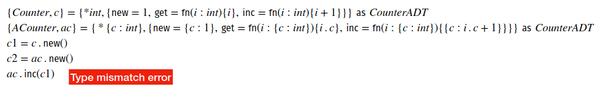
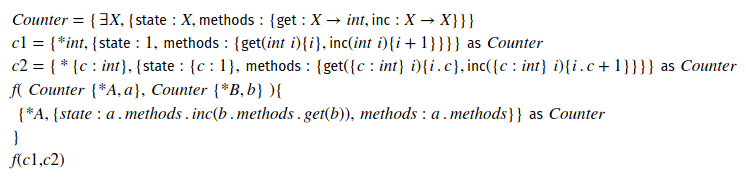
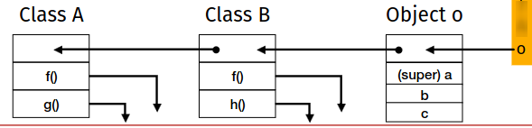
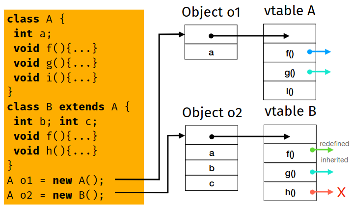

# Introduzione ai tipi
## Un po' di storia
**Paradosso di Russel**: \
Sia $R = {x | x \not \in x}$ \
Allora $R \in R \iff   R \not \in R$

Con il sistema di tipi si riesce ad evitare il paradosso

### Sistema dei tipi
> Un metodo sintattico praticabile per dimostrare l'assenza di determinati comportamenti del
programma, fatto classificando le unità sintattiche in base ai tipi di valore che assumono.

Possiamo interpretare i tipi come **collezioni di valori omogenei e rappresentabili**
- Omogeneità: Condivisione di proprietà di struttura
- Rappresentabilità: Numeri non sempre rappresentabili, come i reali o infinito

## Tipi di Dato
### Supporto all'organizzazione Concettuale
I tipi aiutano nella stesura del programma, dalla documentazione alla progettazione

### Supporto all'Astrazione
Modulazione nei linguaggi, che permettono di "impacchettare" e legare insieme diversi parti di software

L'esempio principe sono le interfacce, che associano un tipo ad operazioni

Tramite l'astrazione possiamo usare parti senza sapere l'implementazione sottostante

### Supporto alla Correttezza
**Type-checking**: Possibilità di usare i tipi per controllare errori sintattici/di tipo

**Refactoring**: Ristrutturazione del codice esistente. \
Con un sistema di tipi statico è possibile cambiando un tipo di una struttura il type checker indica tutti i punti in cui è da cambiare il tipo

#### Safety
Capacità di un lingauggio di garantire l'integrità delle sue astrazioni

Lingauggi *safe* sono detti *strongly typed*

Controlli possibili a Compile Time o a Run Time (assegnazione sbagliata o array Out of Bound)

### Supporto all'Implementazione
I tipi possono contribuire all'efficienza dei programmi, come rimuovere controlli dinamici per garantire la sicurezza

## Dynamic vs Static Typing
Linguaggio tipato **staticamente**: Se possiamo controllare i tipi sul testo del programma, senza doverlo eseguire \
Il compilatore può eliminare le annotazioni di tipo dal codice generato

Linguaggio tipato **dinamicamente**: Quando il controllo dei tipi avviene durante l'esecuzione del programma \

**Manifest typing**: Scrivo esplicitamente il tipo della variabile e delle operazioni (di solito linguaggi con questa caratteristica sono compilati)

**Inferred typing**: Gli algoritmi deducono il tipo dal contesto, non è necessario scrivere in modo esplicito il tipo

# Tipi Base e l'Algebra dei Tipi
## Sistema di Tipi
Ogni linguaggio ha un proprio **sistema di tipi**, i valori dei tipi di chiamano **abitanti** (inhabitants), che comprende:
1. Un insieme di *tipi di base*
2. Meccanismi per *definire nuovi tipi*
3. Meccanismi di *computazione sui tipi*, che includono:
  1. Regole di *equivalenza*
  2. Regole di *compatibilità*
  3. Regole/Tecniche di *inferenza*
4. La definizione sul controllo dei vincoli di tipo statico o dinamico

## Tipi Base
Tipi primitivi/semplici/scalari sono i tipi che definiscono i valori denoabili del linguaggio

## Tipo Unit (vs Void)
Tipo elementare che può contenere l'unità singoletto

`void` in C o Java è simile a Unit, ma non possiamo passarlo come argomento delle operazioni

Unit si usa per segnalare che ci saranno side effect dopo l'utilizzo di una funzione (come stampa a schermo, ecc)

## Tipi Booleani
True e False, operazioni logiche principali

A seconda del linguaggio richiedono 1 o più byte

## Tipi Carattere
- Valori: Un insieme di codici di caratteri (ASCII e UNICODE)
- Operazioni: Dipendono dal linguaggio (`==`, `<`, `>`)

## Tipi Interi
- Valori: Un sottoinsieme finito di numeri interi
- Operazioni: uguaglianza, confronti e principali operazioni aritmetiche

## Tipi Reali
- Valori: Un sottoinsieme finito di numeri reali, memorizati tramite virgola fissa/mobile
- Operazioni: uguaglianza, confronti e principali operazioni aritmetiche

## Tipi Enumeration
`enum RogueOne { Jyn, Cassian, Chirrut, K2SO, Bodhi, Baze }`

Introduce un nuovo insieme chiamato `RogueOne` costituito da un insieme di 6 elemnti

*Non tutti i linguaggi integrano gli enum in modo sicuro*, infatti C equipara completamente i valori all'interno dell'`enum` ad interi

## Extensional vs Intensional Types
- **Estensionale**: modo in cui l'utente specifica gli `enum`, ovvero elencando lui i valori possibili
  - quando è più efficiente (per spazio o computazione) specificare gli abitanti del tipo o non abbiamo un insieme chiaro di regole che li definiscono
- **Intensionale**: modo in cui i lingauggi specificano interi, float, ecc. Ovvero non facendoli decidere all''itente
  - quando si dispone di un insieme definito di proprietà che identificano solo gli abitanti (valori validi) del tipo che stiamo definendo, con il vantaggio di risparmiare memoria se l'insieme degli abitanti è grande e di rendere possibile la definizione, nel caso di insiemi infiniti

## Tipi Composti
Possiamo creare nuovi tipi componendo quelli di base (come gli `enum` in C)

Altre strutture possono essere *array*, *insiemi* e *puntatori*

## Tipi Array
Insieme di elementi dello certo tipo, indicizzato da almeno una *chiave identificativa* di un certo tipo

Operazioni:
- Selezione (`a[e]` e `a[e1][e2][e3]`)
  - Nota: è un'operazione del tipo come `+`, ecc
- Assegnazione
- Confronti
- Operazioni Aritmetiche

I linguaggi safe verificano che ogni accesso ad un elemento di un array avvenga entro i limiti di dimensione, il C non lo fa, ed infatti C è soggetto ad attacchi di **buffer-overflow**

Array multidimensionali possono essere memorizzati in *Row-major order* o in *Column-major order*, a seconda di quale implementazione viene scelta (a runtime) e della modalità di accesso può dare vita a prestazioni diverse (più o meno accessi in cache)

Il **numero di dimensioni** e i **loro intervalli** determinano la forma di un array. A seconda del linguaggio si deve o meno fissare la forma degli array. Se la forma è fissa possiamo metterlo in Stack, altrimenti con array dinamici è necessario metterlo nello Heap

Nel caso di array di forma statica nello Stack di memorizza il *Stack Frame*, che comprende *Frame pointer* e i valori dell'array

In caso di array di forma dinamica il descrittore dell'array è memorizzato nello Stack e si chiama **dope vector**:
- Puntatore a dove si trova l'array nella Heap
- Tipo degli elementi
- Dimensioni (rank) dell'array
- Lunghezza
- *Extent in use*, quantità dinamica di memoria per risparmiare spazio
- *Max extent*, circa uguale
- *Stride*, Tipo degli elementi (comprese strutture dati), spesso uguale al tipo degli elementi base

### Differenze tra i tipi Array in C, Java e Rust


## Tipi Insieme
Denota una struttura dati piatta e senza ordine, di valori unici e dello stesso tipo

Operazioni possibili sono *test di inclusione*, e le comuni operazioni sugli insiemi

Un modo efficiente per rappresentare un insiemee un array di lunghezza pari alla cardinalità del tipo di base in bit, chiamato **array caratteristico** \
In esso il bit j-esimo indica se l'elemento appartiene o meno all'insieme. Questo però occupa moltissimo spazio, infatti oggi si usano le tabelle hash

## Tipi Riferimento
> *Qualcosa* che fa riferimento ad un dato

Operazioni possibili sono *creazione*, *controllo dell'uguaglianza* e *deferenziazione* (accesso al dato referenziato)

Particolarmente presenti in linguaggi a basso livello

L'implementazione più comune è quella del puntatore, usati anche con gli array come istanza dei riferimenti

I riferimenti possono diventare:
- **Wild**: Quando non inizializzati
- **Dangling**: Quando il dato referenziato è stato deallocato

Sintassi C: `int* x`, riferimento (puntatore) ad una locazione di memoria (variabile) che contiene un intero

Esiste il puntatore *canonico* `NULL`

I linguaggi con riferimenti forniscono un **operatore di riferimento alle variabili**, in C `&`

Esiste anche un **operatore di dereferenziazione**, in C `*`

``` c
float pi = 3.1415;
float* p = NULL;
p = &pi;
*p = *p + 1;
```

- In questo esempio assegnamo il float alla variabile di nome `pi`
- Dichiariamo un puntatore ad un float con nome `p`, inizializzandolo a `NULL`
- Assegnamo al dereferenziazione di `pi` alla variabile `p`, così che tramite `p` possiamo accedere al valore
- Il box con dentro `3.1415` avrà `4.1415`

### Memory Leak
Nei linguaggi con riferimenti può incorrere una **deallocazione implicita**, ovvero quando cambiamo il valore del puntatore a `NULL` in C

Questo può causare **memory leak**, ovvero porzioni di memoria non accessibili ma ancora in uso \
Alcune soluzioni sono dei *garbage collector* o *borrow checker*

Un'altra cosa che hanno i linguaggi con riferimenti è un operatore di **deallocazione esplicita**, come la `free()` in C \
È buona norma NULLificare un puntatore liberato da `free()`, così da non avere una *dangling reference*

### Rust
In Rust ci sono i puntatori ma hanno una gestione sicura tramite controlli sintattici effettuati a compile time

## Insiemi potenza
Insieme potenza:
$$\mathbb{P}(A) = \{B : B \subseteq A\}$$

Coppia:
$$(a, b) := \{\{a\}, \{a, b\}\}$$

Insieme cartesiano:
$$A \times B := \{(a, b) : a \in A \land b \in B\}$$

Il prodotto cartesiano è un insieme non proprio di $\mathbb{P}(\mathbb{P}(A \cup B))$

## Tipi prodotto
Quando si combinano due o più tipi in una struttura fissa si parla di **tipi prodotto**, come coppie, tuple, record e varianti

### Coppie e Tuple
> Tupla: Prodotto di $n$ tipi come prodotto cartesiano

> Coppia: Tupla a 2 tipi

### Record
Strutture in C/Rust, Classi/Record in Java. Gli elementi di un **record** sono chiamati *campi*

L'ordine dei campi può essere significativo per la rappresentazione in memoria, poichè spesso memorizzati in posizioni contigue abbiamo bisogno di padding in alcuni casi

Esempio di C di SO, dove l'ordine di `long` e `int` nelle strutture cambia la quantità di spazio richiesto in memoria

In Rust inoltre non possiamo assegnare 3 su 5 elementi di un array, ma mettere un elemento nullo, altrimenti avremo un errore

### Pattern Matching
Abbiamo bisogno di costrutti per *destrutturare* i tipi prodotto, uno di questi è il **pattern matching**

Esempio in Rust:
``` rust
struct Person { name: [ char; 3 ], age: i32 }
struct PersonR { name: [ char; 3 ], age: [ char; 4 ] }

let eva = Person{ name: ['E','v','a'], age: 25 };
let Person{ name, age } = eva; // implicit pattern-matching

let evaR = PersonR{ name, age: match age {
  1..=10 => [ 'K','i','d','' ],
  11..=20 => [ 'T','e','e','n' ],
  _ => [ 'O', 'l', 'd', '' ]
}}
```

### Tipi Ricorsivi
Utili per definire strutture dati che possiamo modificare dinamicamente. Esempio di tipo ricorsivo in Java:
```
record IntList( int n, IntList cons ){}
IntList l = new IntList(
  1, new IntList(
    2, new IntList( 3, null )
  )
);
```

## Tipi Somma
I tipi somma descrivono **composizioni di tipi**


Nota `int*` si chiama *insieme etichettato*, così facendo sappiamo sempre se ho carattere o intero (esempio con `0`)

Le unioni disgiunte di tipi sono solitamente chiamate **tipi somma**

In alcuni linguaggi possiamo usare le `enum` per catturare il caso dei tipi somma (come con Rust)

Java ha inoltre introdotto le `sealed classes`, che definiscono le uniche strutture dati che possono apparire come uno dei possibili tipi presenti in un dato tipo somma

In C esistono le `union`, ma nel caso si legga un `char` come intero non abbiamo un errore

### Tipi Ricorsivi
I tipi somma sono un'alternativa ai tipi prodotto per i tipi ricorsivi (non serve `NULL`)

## Relazioni e Funzioni
Una **relazione** è un sottoinsieme di una sequenza di insiemi, che rappresente appunto la relazione tra elementi

Una **relazione binaria** è una relazione in cui gli insiemi in oggetto sono solo due (anche due volte lo stesso)

Una relazione è detta **funzione parziale** se mappa ogni valore del dominio ad un unico valore del codominio, e non assumiamo che la relzione consideri tutti i valori del primo insieme (dominio)

Se abbiamo $S = \{1, 2, 3\}$ e $T = \{f, t\}$ il numero di possibili $g : S \rightarrow T$ è $2^3$. Che sono $((f, f, f), (t, f, f), \dots, (t, t, t))$

Possiamo quindi definire gli insiemi (o meglio delle relazioni) così $f = \{(1, 1), (2, 0), (3, 1)\} = \{1, 3\}$

### Tipi funzione
Non tutti i linguaggi supportano le funzioni come tipo denotabile, di solito lo fanno solo i lingauggi funzionali

Ad esempio, la funzione `T f(P1 p_1, ..., Pn p_n) {...}` ha tipo `P1 -> ... -> Pn -> R` ovvero $R^{P1^{...^{Pn}}}$

## Algebra dei tipi
I tipi prodotto, somma e funzione si chiamani **tipi di dati algebrici**

I sistemi di tipi possono usare le proprietà di questa algebra per esprimere e verificare le proprietà dei programmi


## Equilvalenza di tipo
> Quando sono uguali due tipi?

Le risposte possono variare in base al contesto in cui si verifica l'uguaglianza

### Preordini e equivalenze
Le relazioni binarie godono di proprietà **riflessiva**, **simmetrica**, **antisimmetrica** e **transitiva**

- Quando una relazione è riflessiva e transitiva la chiamiamo **preordine**
- Se è anche simmetrica la chiamiamo **equivalenza**
- Quando è un preordine antisimmetrico la chiamiamo un **ordine parziale**

### Equivalenza di Tipo Nominale
Se il sistema di tipi considera una nozione **nominale**di equivalenza tra tipi ($NTE$) ogni nuova definizione di tipo introduce un nuovo **nome** diverso da quelli esistenti

Sia $name(T) = n$ la funzione che dato un tipo $T$ ritorna il nome associato $n$, allora $T_1 NTE T_2 \iff name(T_1) = name(T_2)$

Quindi sebbene i tipi `Dollaro=int` e `Euro=int` siano indistinguibili per il sistema nominale non sono equivalenti

#### Duck Typing
> Un modo per eseguire il controllo dei tipi a runtime. Finchè riesco ad eseguire la computazione va bene

Ovvero "Se vola come una papera, se starnazza come una papera, e si muove come una papera allora è una papera", per quanto magari non lo sia veramente

### Equivalenza di Tipo Strutturale
Dal duck typing si è arrivati a un'alternativa strutturale (quindi fatta a compile time)

Possiiamo guardare le *differenze strutturali* tra i valori, l'equivalenza di tipo strutturale ($STE$) può quindi essere eseguita staticamente

Dobbiamo però guardare tutte le possibili branch e tutti i vari casi, quindi è più costoso

Quindi la definizione di equivalenza strutturale (più complessa) diventa:


### Tipo Nominale vs Tipo Strutturale
Il tipaggio nominale presenta i seguenti vantaggi:
- Nozione rigorosa di equivalenza
- Collegamento diretto per il runtime
- Denotazione intuitiva dei tipi ricorsivi, come liste di liste
- Il controllo del sottotipaggio è un controllo diretto

Questi vantaggi hanno reso il sistema di tipo nominale la cosa più usata (anche per semplicità)

## Compatibilità di tipo
> Versione indebolita di equivalenza

È una *preordine*, chiaramente non simmetrica

. Siano T e S due tipi:
- I valori di S sono un **sottoinsieme** dei valori di T
- I valori di S sono un **sotoinsieme di valori canonicamente corrispondenti** di T (gli int hanno sempre un float canonico corrispondente)
- I valori di S sono un **sottoinsieme di valori arbitrari corrispondenti** di T. Come quando il linguaggo fa la conversione automatica di un tipo (es. float in int)
- Tutte le **operazioni** sui valori di T sono possibili anche sui valori di S. Questo è l'esempio usato per il duck typing prima

## Coercizione e Casting di Tipo
È necessario avere un sistema di **conversione di tipi**. Chiamiamo **coercizione di tipo** l'applicazione **implicita** di una conversione di tipo canonica/arbiraria

Chiamiamo **casting di tipo** l'annotazione esplicita nel linguaggio di una conversione di tipo (e di valore)

### Esempio
`int x = 1 + 5.4`
- Con coercizione `1` diventa `1.0` e quindi avrò un errore
- Può succedere che si faccia invece sul float
- Oppure si può fare la conversione su entrambi, e dopo aver il risultato la conversione per inserirlo dentro ad `x`

## Inferenza di Tipo
> Processo di attribuizione dei tipi alle espressioni, senza annotazione esplicite dei tipi

Per esempio è il comportamento di base delle assegnazioni di Python

Il type checker verificherà che sia tutto a posto

Con espressioni composte da funzioni è più complesso fare inferenza di tipo e verificare tramite type checker se è tutto a posto. Si usa l'**algoritmo di unificazione** per ottenere il tipo esatto \
Si lascia infatti il *tipo aperto* della variabile fino alla risoluzione delle espressioni

### Algoritmo di Unificazione
> Risoluzione di sistemi lineari per il calcolo di tipi


Note:
- `[]` è l'identità per la composizione, non è un array ma la mappatura di tipi
- `let {S = T} U C' = C` indica tramite pattern matching implicito che estraggo da C (che so essere un insieme) i valori `S`, `T` e `C'`
- `FV(T)` è per ottenere le variabili libere di `T`
- Sul punto 4 abbiamo il caso di tipo funzionale

#### Esempio di esecuzione


Ora controlliamo la correttezza partendo dal nostro insieme `C` di partenza


# Tipi Polimorfi
## Tipi Monomorfici e Polimorfici
Se abbiamo bisogno di fare una funzione max che funziona con più tipi ci può tornare utile avere la possiblità di definire tipi che possano assumere più forme (tipi poli-morfi)

## Poliformismo di tipo
> Astrarre alcuni dettagli dell'istanziazione concreta del tipo

Concetto con interpretaizone condivisa, ma il *modo* in cui i linguaggi di programmazione lo interpretano varia. Tre tipi di poliformismo:
- **Ad-hoc** (sovraccarico/overloading), in cui si sovraccarica la definizione di una data operaizone su diversi tipi specifici
- **Di sottotipo** (subtyping), in cui si stabiliscono relazioni da astratto a specifico tra i tipi, si ottine un poliformismo con operazioni su tipi astratti
- **Parametrico** (universale), in cui abbiamo simboli astratti che rappresentano parametri di tipo

### Poliformismo Ad-hoc
> Il compilatore/runtime del linguaggio distingue dal contesto di chiamata definizioni alternative di operazioni con lo stesso nome (`+` con stringhe o interi)

È una sorta di abbreviazione sintattica che scompare appena risolviamo l'invocazione, rendendo l'overloading un meccanismo di **indirizzamento**(dispatch)

Se il dispatch avviene staticamente nel compilato c'è un'effettiva sostituzione, se è dinamico invece viene fatto attraverso tabelle di ricerca

Spesso overloading e coercizione vanno di pari passo, possiamo scrivere `1 + 2.0` che coercizza `1` in `1.0` e utilizza la definizione di `+` per i float

### Poliformismo di sottotipo
Si basa su una relazione binaria $S <: T$ ($S$ è un sottotipo di  $T$

Un esempio tipico è quello dei sottotipi di `Animale`, come `Gatto` e `Cane`. Questo ritornerà con gli oggetti

$<:$ è un **preordine**, per questo non possiamo usare `Animale` al posto di `Gatto` o `Cane`

Infatti di solito è anche antisimmetrico, il che lo rende un **preordine parziale**

#### Sottotipaggio dei record
```java
type Animal:{name:string)
type Dog:{name:string, bark:string)

type AnimalHouse:{tenant:Animal}
type DogHouse:{tenant:Dog}
```
Dove `Dog` $<:$ `Animal`

- `Animal` e `Dog` sono un esempio di sottotipaggio *in larghezza* (record dei sottotipi con più campi dei loro supertipi
- `AnimalHouse` e `DogHouse` hanno un sottotipaggio *in profondità* (sostituiamo i campi con i sottotipi
- `AnimalHouse` e `DogHouse` sono *covarianti* rispetto a `Animal` e `Dog` perchè mantengono le stesse proprietà del sottotipaggio dei tipi di riferimento, cioè
  - `Dog` $<:$ `Animal`
  - `DogHouse` $<:$ `AnimalHouse`
  - Dato che sono sottotipi *in profondità* possiamo usare `*House` in maniera *covariante* solo per le letture, per le scritture abbiamo problemi (`DogHouse` al posto di `AnimalHouse`)
  - Per le scritture abbiamo bisogno di usarli in maniera *controvariante


#### Sussunzione (subsumption)
> Decidere se $S <: T$

Esistono due tipi per definirla, **estensionale** o **intensionale**. In molti casi, i sistemi di tipi definiscono relazioni di sottotipaggio per i tipi base (`int <: float` o `char <: string`)

In ogni implementazione con il poiliformismo di sottotipo abbiamo il problema che il tipo di ritorno di una funzione non sarà esattamente quello richiesto

### Poliformismo parametrico
I tipi parametrici (come i Set) sono tipi su cui sappiamo di poter fare operazioni (chiamate parametriche) senza sapere esattamente la loro forma

Dobbiamo definire una notazione che renda esplicito quando i tipi accettano parametri, ad esempio la versione parametrica di `Set` può essere vista come `Set<T>`

In Java `<T extends Comparable> T max (T x, T y) {...}`
In Rust `fn max<T: Comparable>(x:T, y:T) -> T {...}`

### Poliformismo parametico e di sottotipo
I linguaggi con poliformismo parametrico permettono di annotare esplicitamnete la direzione che l'utente si aspetta per l'uso dei tipi parametrici


Nota:
- Producer -> Extends
- Consumer -> Super

## Tipi Opzione e Risultato
Il tipo opzione è utile per gestire in maniera strutturata puntatori nulli

L'interprtazione del tipo Option/Maybe è `type Maybe<T> : Some<T> + None`

I tipi risultato sono analoghi ma invece di avere qualcosa/nulla abbiamo ok/errore, sono un'alternativa alla gestione delle eccezioni

# Eccezioni
Possiamo avere una operazione che fallisce, diventa quindi necessario avere un modo strutturato per gestire le eccezioni (i vari tipi)

Una possibile soluzione erano i tipi `Result`, ma è una soluzione macchinosa quando si annidano diverse operazioni

Le **eccezioni** sono un'alternativa ai risultati. In caso di condizione eccezionale (come un errore) il controllo viene trasferito ad un *gestore di eccezioni*

## Gestione delle eccezioni
Alcuni linguaggi implementano il gestore di eccezioni, ad esempio in Java una divisione per 0 causa `java.lang.ArithmeticException: / by zero`

Per gestire le eccezioni allora esiste il costrutto `try {...} catch {...}` o analoghi, ad esempio in Java

```java
try {
  System.out.println( “Let’s try to divide by zero” );
  double x = 1 / 0;
} catch ( ArithmeticException exception ) {
  System.err.println( “You shall not divide by zero!” );
}
```

Le eccezioni sono intercettate **tramite nomi**, che spesso i linguaggi consolidano coi simboli del sistema di tipi

In Java tutti i valori sollevabili (throw) e catturabili (catch) sono sottotipi del tipo speciale `Throwable`

Possiamo distinguere `Error` e `Exception`, `Error` e `RuntimeException` sono fallimenti irrecuperabili, e quindi interropono l'esecuzione del programma

Le altre `Exception` invece possono essere gestite


### Eccezioni Esplicite
Java obbliga a gestire le eccezioni in modo esplicito in due modi:
- Dichiarando che un'operazione lancia un'eccezione
- Gestendo l'eccezione lanciata all'interno dell'operazione

## Implementare il try-catch
Sulle slide c'è un esempio su come viene implementato

# Sicurezza della memoria: Garbage Collection e Borrow-checking
## Dangling Pointers/References
> Dangling: Quando fa riferimento ad una destinazione non valida

Difficili da individuare, in alcuni casi proprio impossibile

> Wild: Quando non sono inizializzati

Piu' semplici da individuare

### Tombstones
> Modo per gestire i riferimenti dangling

Associano ad ogni allocazione a cui accede un puntatore una parola aggiuntiva allocata in memoria, chiamata *tombstone*

Quindi gli accessi al puntatore sono accessi a due hop, prima alla tombstone e poi alla vera locazione di memoria

Tiene sotto controllo tutte le possibili duplicazioni del puntatore, che puntano tutti alla stessa tombstone

Il costo e' la duplicazione delle deferenziazioni, piu' il tempo per creare la tombstone \
Inoltre abbiamo un cimitero con delle tombe non piu' puntate che occupa memoria e che non possiamo liberare

### Locks and Keys
> Alternativa alle tombstone, ma solo per puntatori allo heap. Per ogni alocazione di un oggetto sulla heap ci associamo un *lock* (parola casuale)

Ogni volta che si dereferenzia un puntatore si controlla che la chiave possa "aprire" il lock, cioe' che le due parole coincidano

Puo' accadere che allocazioni successive possano utilizzare l'area di memoria precedentemente usata come lock, ma e' statisticamente improbabile che la cella di memoria attuale contenga esattamente il valore del lock precedentemente presente

Costo significativo, sia come spazio che come efficienza

### Garbage Collector
> Tecnica per non dover gestire manualmente la deallocazione della memoria nello heap

Composto da due parti:
- **Garbage detection**
- **Garbage collection**

Diventa piu' facile lavorare sugli oggetti in memoria se il collector conosce la loro forma/limiti e quali posizioni di un oggetto corrispondono a puntatori

Possiamo fornire queste informazioni sia staticamente che dinamicamente

#### Reference Count
> Trovare oggetti che non hanno puntatori ad essi

Quando si alloca un oggetto nello heap si inizializza un contatore di quell'oggetto che conta i riferimenti a quella porzione di memoria

Quando arriva a 0 allora la porzione di memoria puo' essere liberata

Se un oggetto punta a catena ad altri oggetti bisogna aggiornare anche i loro contatori

Questa tecnica rende impossibile gestire strutture ricorsive e puo' generare memory leak se abbiamo oggetti puntati a vicenda


#### Mark and Sweep
Si eseguono in sequenza due fasi:
- **Mark**: Marca tutti gli oggetti nello heap come garbage, attraversa lo stack e segue i puntatori, demarcando gli oggetti che incontra
- **Sweep**: Visita allo heap che raccoglie tutti gli oggetti ancora marcati come garbage

Mark and Sweep non libera memoria quando incontra garbage, ma e' il runtime che lo invoca quando lo ritiene utile, come quando l'heap sta esaurendo la memoria

Esempio di *stop-the-world* garbage collection, cioe' il programma si ferma per far entrare in funzione quest'ultimo

Facile da implementare ed efficiente rispetto ad altre tecniche incrementali. Hanno pero' due svantaggi principali:
- Il programma non e' reattivo, ha degli spike di latenza
- Le prestazioni sulla fase della marcatura dipendono dalle dimensioni dello heap e dallo stack

#### Inversione di puntatori
Si usa una coppia di puntatori (curr/prev) per seguire e marcare le strutture dati come alberi


#### Stop and Copy
> Evoluzione di Mark and Sweep, consente la pulizia dello heap eliminando sia la prima fase di marcatura che lo sweep

Si divide l'heap in due regioni uguali, tutte le allocazioni avvengono in una meta'

Quando la meta' corrente e' quasi piena viene chiamato il garbage collector, che copia ogni elemento raggiungibile dallo stack nell'altra meta', e rende la porzione di memoria usata in precedenza libera (togliendo quindi tutti gli oggetti non raggiunti)

Per quanto ma memoria sia dimezzata il tempo richiesto e' proporzionale alla quantita' di oggetti non garbage, e aumentando la memoria disponibile diminuiscono le chiamate al garbage collector.

Inoltre c'e' un ulteriore vantaggio perche' viene fatta una deframmentazione della memoria

# Tipi di Dato Astratto e Object Orientation
## Tipi di Dato Astratto
Le macchine gestiscono stringhe di bit. Un tipo di dato astratto è un tipo che con una *capsula* viene nascosto il suo "basso livello", in questo modo con linguaggi type-safe possiamo interagire con il tipo solo attraverso la capsula

Abbiamo quindi che un **tipo di dato astratto** (ADT) e'
> Un tipo che definisce i possibil valori che lo compongono e le possibili operazioni che possono agire su questi

Un ADT e' costituito da:
- Il nome del tipo astratto A
- Il tipo di rappresentazione concreta T
- Implementazioni di operazioni per creazione e manipolazione di valori di tipo A
- Un confine di astrazione che racchiude T e lo rende accessibile solo attraverso le operazioni di A.

### Information Hiding
L'interfaccia collega il pogramma e gli ADT, e permette di nascondere le informazioni relativi a strutture e funzionamento delle operazioni

### Indipendenza della rappresentanza
L'information hiding migliora la componibilita' del codice in modo simile al poliformismo di sottotipo/parametrico

La proprieta' dei type-safe ADT e' chiamata **indipendenza dalla rappresentazione**, cioe' implementaizoni corrette dello stesso ADT sono all'esterno equivalenti

#### Esempio in Rust
```
trait Counter {
  fn new() -> Self;
  fn get( &self ) -> u32;
  fn inc( &self ) -> Self;
}
struct SC { counter: u32 }
impl Counter for SC {
  fn new() -> Self { SC { counter: 0 } }
  fn get( &self ) -> u32 { self.counter }
  fn inc( &self ) -> Self
    { SC { counter: self.counter + 1 } }
}
fn use_counter<C>( c: &mut C ) where C: Counter {
  let c = c.inc(); let c = c.inc(); print!( "{}", c.get() );
}
fn main(){ use_counter( &mut SC::new() ) }
```

### Moduli
Gli ADT possono essere visto come modo per "aggregare" il codice che  appartiene allo stesso tipo in un unico artefatto

> Il **modulo** e' un modo per fornire piu' ADT all'interno dello stesso pacchetto

Abbiamo in comune ai vari linguaggi sono la possibilita' si suddividere il programma in modo che ogni modulo contenga dati e operazioni, e la visibilita' dei dati che racchiude

Notiamo che gli ADT sono un caso degenere dei moduli

### ADT e Tipi Esistenziali
Possiamo vedere il `trait` di Rust come prima come un tipo esistenziale, perche' non vediamo il tipo concreto. Grazie a questo possiamo avere type safety anche senza sapere il tipo concreto a cui si appoggia l'ADT

Al contrario degli oggetti possiamo usare due tipi che implementano l'interfaccia `CounterADT` tra di loro, perche' per il sistema di tipi risultano compatibili tra loro

## Oggetti Esistenziali
Abbiamo visto che possiamo implementare un'interfaccia in piu' modi con gli ADT, catturano l'information hiding e l'indipendenza della rappresentazione, ma rendono incompatibili le due implementazione di un'interfaccia



Gli oggetti esistenziali sono un'alternativa agli ADT, che consente a piu' implementazioni dello stesso tipo esistenziale di interagire

Possiamo definire oggetti come *tipi concreti* che *mantengono il loro stato* (implementazione) *interno* e portano con se' l'associazione con il loro tipo esistenziale

Esempio di ADT fatto pero' con gli oggetti:


Qui vediamo che non abbiamo definizione di tipo e generazione di un abitante, ma il tipo e l'abitante sono la stessa cosa

### Oggetti vs ADT
Gli ADT adottano una visione "aperta" dei tipi esistenziali, quando importiamo una implementazione la "apriamo" immediatamente, prima dell'uso effettivo

Con gli oggetti manteniamo sempre "chiuso" un oggetto e usiamo i suoi metodi per accedere al suo stato interno

La differenza principale e' quindi che un programma puo' liberamente mescolare implementazioni dello stesso tipo di oggetto (esistenziale)

Questo risulta molto comodo in presenza di **sottotipaggio** e di **ereditarieta'**

### Oggetti in OOP
> Capsula che contiene sia dati che operazioni per manipolarli e che fornisce un'interfaccia al mondo esterno attraverso la quale è possibile accedervi

Per gli oggetti:
- operazioni = metodi
- variabili interne = campi

Operazioni e variabili su oggetti possono essere visibili ovunque, visibili solo per alcuni oggetti o anche completamente private

## Classi
> Specificare un modello di implementazione di un riferimento che contiene le variabili e i metodi comuni alla stessa classe di oggetti

```java
class Counter {
  private int x=1;
  public int get(){
    return x;
  }
  public void inc( int i ){
    x = x+i;
  }
  }
Counter c1 = new Counter();
Counter c2 = new Counter();
Counter c3 = new Counter();
```

Le classi memorizzano l'implementazione del codice di tutti i suoi oggetti e se piu' oggetti usano lo stesso metodo usiamo un'unica implementazione, ovvero salviamo l'implementazione del metodo in memoria una sola volta

`self` o `this` vengono usati per indicare l'oggeto corrente

### Gestione di Oggetti in Memoria
Linguaggi come Java memorizzano gli oggetti sull'heap usando il garbage collector per gestire la deallocazione

Linguaggi come C++ invece consentono l'allocazione e la deallocazione manuale sullo stack

### Classi vs Prototipi
Alternativa alle classi, si basa sulla possibilita' per gli oggetti di delegare parti della loro implementazione ad altri oggetti

- Se l'oggetto non possiede quel campo o non definisce quel metodo, questo delega implicitamente l’azione al delegato
  - Se il delegato possiede quel campo o implementa quel metodo, allora esegue l'azione associata e riferisce al figlio il risultato
  - Al contrario, la catena di chiamate prosegue ai delegati dei delegati e così via, eventualmente fino a raggiungere il prototipo vuoto e a segnalare un errore

Un oggetto basato su prototipi puo' cambiare il suo delegato a tempo di esecuzione, un comportamento quasi sempre impedito nei linguaggi basati su classi

### Encapsulation (Incapsulamento)
Si distinguono almeno due viste, quella **privata** e quella **pubblica**. La vista pubblica di un oggetto e' solitamente indicata come **interfaccia**

#### Sottotipi
In OO possiamo considerare le **classi come i tipi**

Possiamo accedere ai campi di `S` disponibili in `T`, e di invocare metodi di `S` disponibili in `T` (con `S <: T`)

### Abstraction (Astrazione)
Le **interfacce** fanno da ponte (linguistico) tra classi e tipi.

Per questo consideriamo la definizione di un classe come accompagnata da una definizione implicita di un'interfaccia della vista pubblica di quella classe

Le interfacce permettono di descrivere cosa una classe puo' fare. Questo principio prende il nome di **principio di astrazione**

### Inheritance (Ereditarieta')
Il sottotipaggio da interfaccia a classe presuppone una relazione di sottotipaggio da interfaccia ad interfaccia, questo viene chiamato **estensione**

Quando applichiamo il **sottotipaggio per le classi**, applichiamo l'idea di estendere da interfaccia ad interfaccia per coprire anche los tato, i vincoli di incapsulamento e l'implementazione dei metodi delle classi

Questo relazione prende il nome di **ereditarieta'**

#### Shadowing di variabili
Una sottoclasse puo' mascherare i campi della superclasse definendo campi con lo stesso nome

Java adotta una notazione esplicita per non creare ambiguita' (`super` e `this`)

#### Overriding di metodi
Possiamo fare override delle implementazioni dei metodi ereditati, ovvero "sovrascriverli"

La differenza e' che l'overriding viene risolto dinamicamente, mentre lo shadowing delle variabili viene risolto staticamente

#### Visibilita'
Abbiamo visto `private` e `public` per cambiare la visibilita' di variabili e metodi

Esiste anche il caso `package`, che estende la visibilita' di una classe a tutte le classi che appartengono allo stesso modulo di quella classe

Esiste anche il caso `protected`, che estende il caso package per consentire a qualsiasi sottoclasse (in qualsiasi modulo) di interagire (internamente) con i campi/metodi protetti della propria superclasse

#### Riassumendo
- I **sottotipi** hanno a che fare con la **possiblita' di utilizzare un oggettoin un altro contesto**
  - Relazione tra *interfacce* di due classi
- L'**erediatarieta'** ha a che fare con la **possiblita' di riutilizzare il codice che manipola un oggetto**
  - Relazione tra *implementazioni* di due classi

### Classi Astratte
> Via di mezzo tra interfacce e classi, in quanto possono definire campi e implementazione di metodi, ma anche lascare metodi astratti che le sottoclassi devono implementare/sovrascrivere

Usato per i "fratelli"

### Relazione di Sottotipaggio
#### Top
In Java esiste un tipo che e' il tipo padre di tutti i tipi, chiamato `Object`, questo e' utlie per poter usare un tipo generico nei metodi, ad esempio per clonazione o controlli di uguaglianza per "riferimento"

#### Tipi Intersezione
Possibile fare `extends` di piu' classi, nel caso ci siano sovrapposizioni si chiama **tipo intersezione**, se non c'e' si chiama **tipo unione**

### Costruttori
Possono esistere procedure diverse per istanziare un oggetto. I costruttori rispondono a questa esigenza

Il costruttore permette di effettuare correttamente l'inizializzazione dei dati, collegando classe e superclasse

### Ereditarieta' Singola vs Multipla
In alcuni linguaggi una classe puo' ereditare una sola superclasse, e quindi la gerarchia di ereditarieta' e' un albero

Altri invece consentono di ereditare metodi da piu' superlcassi, e quindi la gerarchia di ereditarita' e' un DAG

L'eredita' multipla porta pero' a problemi concettuali e di implementazione

#### Problemi della Ereditarieta' Multipla
Abbiamo un **conflitto di nomi**, risolvibile (in parte) con:
- Vietare sintatticamente i conflitti
- Risolvere esplicitamente ogni conflitto (in C++ si usa `A::method()`)
- Stabilire una convenzione su quale prendere

### Dynamic Dispatch
> Il punto in cui astrazione ed ereditarieta' si incontrano e danno origine ad uno dei tratti paradigmatici dell'orientamento agli oggetti

Una sottoclasse puo' ridefinire (override) l'implementazione di un metodo, in modo che il codice eseguito dipnda dal **tipo** di oggetto che riceve il messaggio/metodo

#### Overriding e Overloading
Overriding | Overloading
:-: | :-:
Late Binding | Early Binding
Informazioni disponibili a tempo di **esecuzione** | Informazioni disponibili a tempo di **compilazione** (statiche)

## Metodi Statici
Specifici del linguaggio, non e' una caratteristica del paradigma OO

Alcuni linguaggi permettono di usare `static` per indicare i metodi che il compilatore puo' risolvere staticamente

I metodi statici **non possono essere sovrascritti**, solo sovraccaricati

E' anche possibile **mascherare i metodi statici** e accoppiarli con il sottotipaggio

## Aspetti di Implementazione
### Oggetti
```java
class A {
  int a;
  void f(){...}
  void g(){...}
}
class B extends A {
  int b; int c;
  void f(){...}
  void h(){...}
}
A o;
o = new B();
```



In un linguaggio a tipaggio statico questa rappresentazione permette di calcolare l'offset di ogni variabile e accedervi in tempo costante

### Classi ed Ereditarieta'
Per le classi l'implementazione piu' semplice di classi ed ereditarieta' e' quella di elenco concatenato

Questo e' chiaramente inefficiente, perche' per colpa del late binding implica la vista lineare della gerarchia delle classi

### Late *self* binding
Per l'esecuzione di un metodo avviene quello che avviene per le procedure. A differenza delel procedure i metodi devono accedere anche alle variabili di istanza dell'oggetto su cui vengono allocati (noti solo a run time)

Invece di fare riferimento all'oggetto stesso ed eseguire una doppia ricerca, possiamo definire l'accesso ai campi di istanza come un offset dall'oggetto corrente, e quindi effettuare una sola ricerca

### Ereditarieta' Singola
Se i tipi sono statici, gli oggetti hanno un insieme finito e **statico** di metodi, che crrispondono a quelli nel descrittore della classe

Questa struttura dati prende il nome di **vtable** (virtual function table)

Con le vtable, ogni definizione di classe corrisponde a una vtable, e tutte le istanze di quella classe condividono la stessa vtable

Quando deiniamo una sottoclasse duplichiamo la vtable, sostituendo tutti i metodi ridefiniti e aggiungendo in fondo i nuovi metodi

In questo modo l'invocazione di un metodo avviene a tempo costante e tiene conto del fatto che si puo' accedere ad un oggetto come ad una delle sue super classi

### Classe Base Fragile
Per l'ereditarieta' singola le vtable sono molto efficienti, perche' la maggior parte delle informazioni e' determinata staticamente. Il late binding di `self` pero' causa un problema chiamato **classe base fragile**

Si verifica un problema se qualche sottoclasse usa parti di una superclasse che sono state modificate. Puo' essere risolto limitando l'erediarieta' in favore del sottotipaggio


Aggiungendo il metodo `i()` ad `A` abbiamo che dobbiamo ricompilare anche `B` e tutte le altre sottoclassi di `A`

### Dynamic Method Dispatch (JVM)
Java compila le classi separatamente l'una dall'altra, e ogni classe da' origine ad un file che la macchina virtuale **carica dinamicamente** quando il programma in esecuzione fa riferimento a quella classe

Questo file contiene la **constant pool**, la tabella di simboli utilizzati nella classe stessa

Quando, in fase di esecuzione, si fa riferimento a un nome per la prima volta (attraverso il suo indice), questo viene risolto: la macchina virtuale carica le classi necessarie(ad esempio quelle in cui viene introdotto il nome) utilizzando le
informazioni del pool di costanti

Altri aspetti sulle slide

## Java
### Poliformismo Parametrico e Generici
Java adotta la nomenclatura **generics** per indicare l'inclusione di questa caratteristica per supportare la programmazione generica

`<T> max ( T x, T y ) { return x > y ? x : y; }`

### Generici e Type Erasure
Java usa la *type erasure*, che fa si' che tutte le istanze di una determinata classe generica condividano lo stesso codice

### Type Parameter Erasure
Non possiamo ovviamente invocare `new T()`, poiche' il compilatore non sa che oggetto creare

In java abbiamo il meccanismo di reflection `instanceof`, anche se non e' in grado di distinguere tra `Set<Integer>` e `Set<String>` perche' in case di compilazione vengono risolte entrambe in raw `Set`

### Generici, Wildcards
Per esprimere annotazioni di **varianza sui generici** Java ha introdotto il carattere wildcard `?` come speciale, quindi abbiamo il tipo `T<?>`, un super tipo di qualsiasi applicazione del tipo generico `T`

Possiamo usarlo anche per esplicitare la covarianza e la controvarianza con `T<? extends S>` e `T<? super S>`
