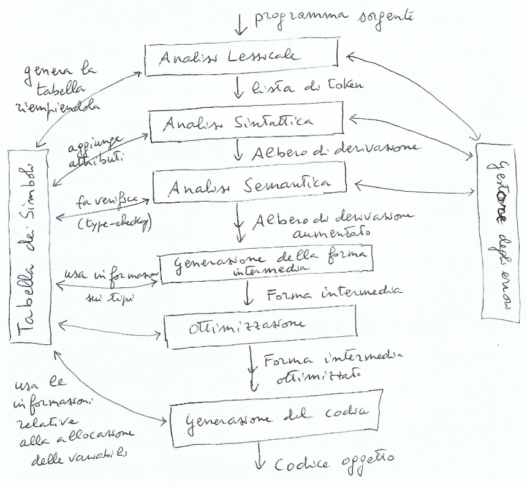
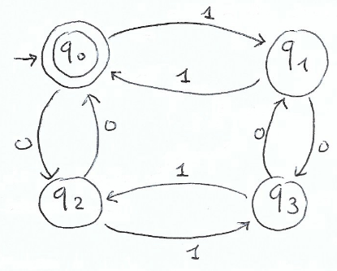

# Capitolo 1 - Interpreti e Compilatori
$I^{L_A}_{L_B} \rArr$ Interprete scritto in $L_A$ per il linguaggio $L_B$

$C^{L_A}_{L_B, L_C} \rArr$ Compilatore scritto in $L_A$, che traduce da $L_B$ in $L_C$

# Capitolo 2
## Descrivere un linguaggio di programmazione
- **Sintassi**: Regole di formazione
- **Semantica**: Attribuzione di significato
- **Pragmatica**: In quale modo frasi corrette?
- **Implementazione**: Come eseguire una frase corretta

Quest'ultimo ovvimente solo per i linguaggi di programmazione

Linguaggi:
- Generativi (da Grammatica)
- Riconoscitivi(da Automa)

## Grammatica Libera
- Quadrupla $(NT, T, R, S)$ dove
  - $NT$ insieme finito di simboli non-terminali
  - $T$ insieme finito di simboli terminali
  - $R$ insieme finito di produzioni nella forma
    - $V \rarr w$ dove $V \in NT$ e $w \in (T \cup NT)^*$
  - $S \in NT$ è detto simbolo iniziale
- Esempio: $G = (\{S\}, \{a, b, +, *\}, S, R)$
  - dove $R = \{S \rarr a, S \rarr b, S \rarr S + S, S \rarr S * S\}$

Forma in cui si trova di solito: $S \rarr a | b | S + S | S * S$

## Derivazioni
Data $G = (NT, T, R, S)$ libera diciamo che *$v$ si riscrive in un passo in $w$*, denotato con $v \rArr w$, se

$$\frac{v = xAy \qquad (A \rarr z) \in R \qquad w = xzy}{v \rArr w} \qquad x, y, z \in (T \cup NT)^*$$

Diciamo inoltre che *$v$ si riscrive in $w$*, denotato con $v \rArr^* w$ se $v$ si riscrive in più passi in $w$

## Linguaggio generato
Il linguaggio generato da una grammatica $G = (NT, T, R, S)$ è l'insieme
$$L(G) = \{ w \in T^* | S \rArr^* w\}$$

Esempio: $G: S \rarr aSb | ab$ genera $L(G) = \{a^n b^n | n \geq 1 \}$

## Derivazioni e Alberi
- Consideriamo $S \rarr a | b | c | S+S | S*S$ e l'espressione $a + b * c$
- Consideriamo la **derivazione** $S \rArr \underbar{S} * S \rArr \underbar{S} + S * S \rArr a + \underbar{S} * S \rArr a + b * \underbar{S} \rArr a + b * c$
  - **leftmost**: ad ogni passo riscriviamo il non terminale più a sinistra
  - possibile associarci un *albero di derivazione*
- Consideriamo ora la **derivazione** $S \rArr S * \underbar{S} \rArr \underbar{S} * c \rArr S + \underbar{S} * c \rArr \underbar{S} + b * c \rArr a + b * c$
  - **rightmost**: ad ogni passo riscriviamo il non terminale più a destra
  - possibile associarci lo stesso *albero di derivazione*

**Teorema**: $w \in T^*$ appartiene a $L(G)$ $\iff$ ammette un albero di derivazione completo

## Ambiguità
- Una grammatica libera $G$ è **ambigua** se $\exists w \in L(G)$ che ammette più alberi di derivazione
- Un linguaggio $L$ è **ambiguo** se tutte le grammatiche $G$ che lo generano sono ambigue
- Grammatiche **patologiche**, quando non è possibile manipolarle per disambiguarle
- Esempio di linguaggio ambiguo:
$$\{a^n b^n c^m d^m | n, m \geq 1\} \cup \{a^n b^m c^m d^n | n, m \geq 1\}$$

## Struttura di un Compilatore

## Fasi principali della Compilazione
### Analisi Lessicale (Scanner)
- Spezza il programma sorgente nei componenti sintattici primitivi (*tokens*)
- Controlla solo che il lessico sia ammissibile

### Analisi Sintattica (Parser)
- Produce l'albero di derivazione del programma, riconoscendo se le frasi sono sintatticamente corrette
  
### Analisi Sematica
- Controlli di semantica statica
- Ad esempio arricchisce l'albero di derivazione generato dal Parser con informazioni sui tipi

### Generazione della forma intermedia
- Genera codice scritto in un linguaggio intermedio

### Ottimizzazione
- Ottimizzazioni sul codice per renderlo più efficente
- Esempi: dead code, macro, ecc

### Generazione del codice
- Viene generato codice per una specifica architettura

### Tabella dei simboli
- Memorizza le informazioni sui nomi presenti nel programma
  
## Semantica Operazionale Strutturata
### Come dare la semantica?
- **Sistema di transizione**: tripla $< \Gamma, T, \rarr >$ dove
  - $\Gamma$ è l'insieme di stati
  - $T \subseteq \Gamma$ è l'insieme degli stati terminali
  - $\rarr \subseteq \Gamma \times \Gamma$ è la relazione di transizione
- Store $\sigma = \{ x_1 / n_1, x_2 / n_2, \dots, x_k / n_k \}$

### Semantica delle espressioni aritmetiche
EVENTUALMENTE AGGIUNGERE COSE (TODO)

# Capitolo 3 - Analisi Lessicale
## Analisi Lessicale
- Riconoscere nella stringa in ingresso gruppi di simboli che corrispondono a specifiche categorie sintattiche
- La stringa in input è trasformata in una sequenza di *token*
### Cos'è un *token*?
- $Token = (nome, valore)$
- Esempio: $<Ide, x_1>$

### Espressioni Regolari
- Fissato un alfabeto $A = \{ a_1, a_2, \dots, a_n \}$ definiamo le espressioni regolari con la seguente BNF
$$ r ::= \emptyset \mid \epsilon \mid a \mid r \bullet r \mid r | r \mid r^* $$

### Linguaggio Regolare
- Linguaggio $L \subseteq A^*$ è **regolare** se $\exists$ $r$ espressione regolare che lo genera
- **Proposizione**: Ogni linguaggio finito è regolare

## Automi (a stati) Finiti
- Caratteristiche:
  - Memoria finita
  - Input: stringa da riconoscere
  - Output: 1 bit (sì/no)
- Leggono l'input in ordine fino a che
  - Finiscono l'input e riconosce la stringa
  - Si blocca e non riconosce la stringa

### Diagrammi di Transizione
$$L = \{ w \in \{ 0, 1\}^* \mid \text{numero di 0 e 1 è pari}\}$$

## Automi Finiti Nondeterministici
- Un NFA è un quintupla $(\Sigma, Q, \delta, q_0, F)$ dove
  - $\Sigma$ è un alfabeto finito di simboli di input
  - $Q$ è un insieme finito di stati
  - $q_0 \in Q$ è lo stato iniziale
  - $F \subseteq Q$ è l'insieme degli stati finali
  - $\delta$ è la funzione di transizione con tipo:
$$\delta: Q \times (\Sigma \cup \{ \epsilon \}) \rarr P(Q)$$

### Linguaggio riconosciuto
- Un NFA accetta $w$ $\iff$ nel diagramma di transizione esiste un cammino da $q_0$ ad uno stato finale nel quale si ottiene $w$
## Deterministic Finite Automata (DFA)
- $\delta(q, G)$ è sempre un singoletto
  - ovvero esiste solo una mossa possibile da ogni stato
- non ci sono mosse $\epsilon$
- Un DFA è una quintupla $(\Sigma, Q, \delta, q_0, F)$, dove $\Sigma, Q, q_0, F$ sono definiti come un NFA, ma $\delta$ ha tipo $\delta: Q \times \Sigma \rarr Q$
- **Proposizione**: Per ogni NFA, è possibile costruire un DFA ad esso equivalente
### Esempio

### Costruzione dei sottoinsiemi
Dato un NFA $N = (\Sigma, Q \delta, q_0, F)$
- Inizializza $S = \epsilon - closure(q_0)$
- Inizializza $T = \{ S \}$
- Finchè c'è un $P \in T$ non marcato
  - Marca $P_i$
  - For each $a \in \Sigma$
    - $R = \epsilon - closure(mossa(P, a))$
    - If $R \not \in T$
      - add $R$ to $T$
    - Definisci $\Delta (P, a) = R$
### Esempio Corposo

## Equivalenza NFA - DFA
- **Teorema** Sia $N$ un NFA e sia $M_N$ l'automa ottenuto con la costruzione per sottoinsiemi. Allora $M_N$ è un DFA e si ha $L[N] = L[M_N]$
  - **Dimostrazione** TODO (pag 28)

## Da espressioni Regolari a NFA equivalenti
- **Teorema** Data una espressione regolare $s$, possiamo costruire un NFA $N[s]$ tale che $\textbf{L}[s] = L[N[s]]$
  - **Dimostrazione** TODO

### Grammatiche Regolari
- **Def** Una grammatica *libera* è **regolare** $\iff$ ogni produzione è nella forma $V \rarr aW$ oppure $V \rarr a$. È ammessa la produzione $S \rarr \epsilon$
- **Teorema** Data una grammatica regolare $G$ si può costruire un NFA $N_G$ equivalente
  - **Dimostrazione** TODO FORSE

### Da DFA a Grammatiche Regolari
- **Teorema** Da un DFA $M$, possiamo definire una grammatica regolare $G_M$ tale che $L[M] = L(G_M)$
  - **Dimostrazione** TODO FORSE

## Riassunto
Espressioni Regolari, NFA, DFA e Grammatiche Regolari sono **formalismi equivalenti**.

Tutti

| generano | riconoscono | descrivono |
| --- | --- | --- |
| grammatiche regolari | NFA / DFA | espressioni regolari |

la stessa classe di linguaggi, ovvero i **Linguaggi Regolari**

## Minimizzazione
